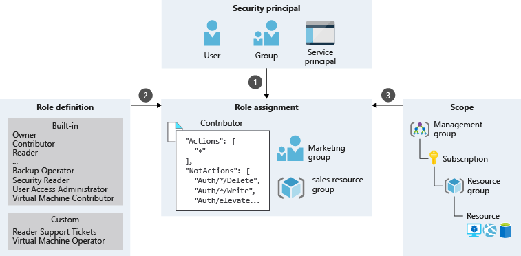

# Azure RBAC

- [azure-rbac](https://learn.microsoft.com/en-us/training/modules/secure-azure-resources-with-rbac/1-introduction)

- Built on **Azure Resource Manager**

## Types of roles

- [types-of-roles](https://learn.microsoft.com/en-us/azure/role-based-access-control/rbac-and-directory-admin-roles)

- Entra roles span Microsoft services including 365 and Entra objects, whereas Azure roles only span Azure cloud

### Microsoft Entra roles

- Global admin
- Application admin
- Application developer
- User Administrator
- Billing admin

### Azure roles

- Owner
- Contributor
- Reader
- User Access Admin
- RBAC Admin

### Classic subscription admin roles

> [!IMPORTANT]
> These roles are retired and from Decemeber 2026 will be replaced with the Owner RBAC role

- Service admins
- Co-admins

## Working of Azure RBAC

### Role Assigments

- Has three elements:
  - Security principal
  - Role definition
  - Scope

- **Security Principle (Who):** The user, user group or **service principal** (an application) or **managed identity** (Azure resources) who is to be granted permission

- **Role definition (What):** A role or role definition is a collection of permissions.

- **Scope (Where):** This is where the role permissions applies. It can be a management group, subscription, resource group or resource

> A role assignment is the process of binding a role to a security principal at a particular scope for the purpose of granting access. To grant access, you'll create a role assignment. To revoke access, you'll remove a role assignment.
