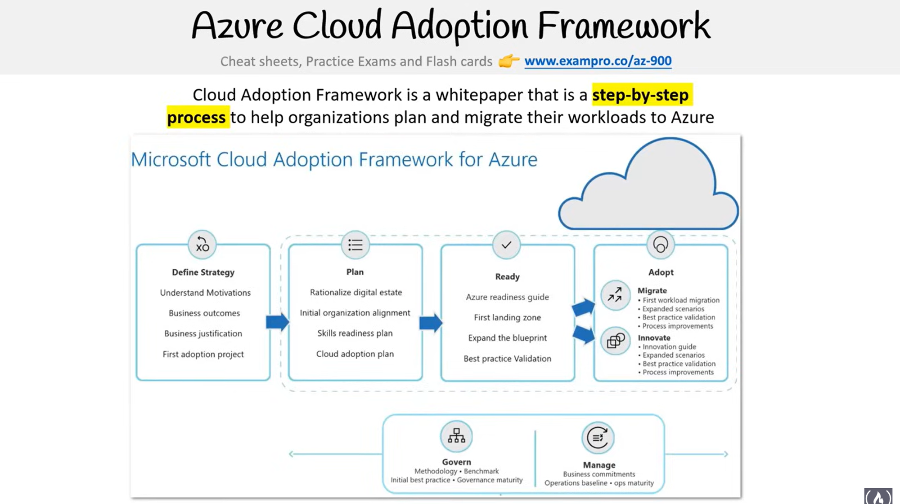
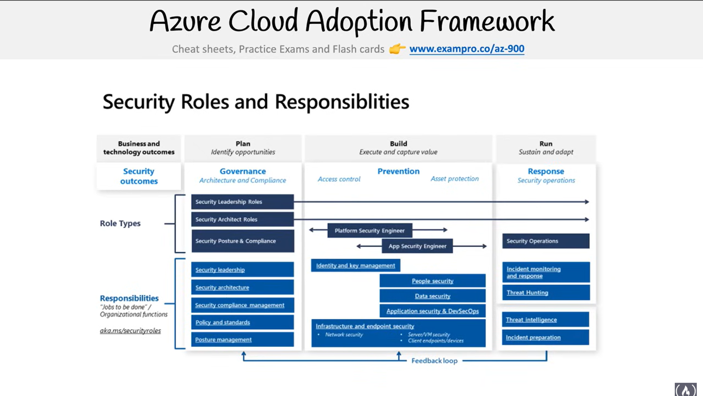

- [Azure Migrate](#azure-migrate)
  - [FreeCodeCamp](#freecodecamp)
    - [Azure Cloud Adoption Framework](#azure-cloud-adoption-framework)
      - [Strategy](#strategy)
      - [Plan](#plan)
      - [Ready](#ready)
    - [Azure Cloud Adoption Framework - Security Roles and Responsibilities](#azure-cloud-adoption-framework---security-roles-and-responsibilities)
    - [Azure Migrate Overview](#azure-migrate-overview)

# Azure Migrate

## FreeCodeCamp

### Azure Cloud Adoption Framework 

- 

#### Strategy

- Understand motivations
- Business outcomes
- Business justification 
- First adoption project: Kickstarting the cloud journey

#### Plan 

- Rationalize digital estate: Take inventory
- Initial organization alignment: Ensure everyone is aligned with the migration's goals
- Skills readiness plan: Ensuring all employees have the appropriate skills to migrate
- Cloud adoption plan: Laying out a roadmap for the cloud transition

#### Ready 

- Azure readiness guide: Preparing the environment for Azure 
- First landing zone: Setting up an initial secure environment
- Expanding the blueprint: Broadening the azure env as per requirements
- Best practice validation: Adhering to azure best practices

### Azure Cloud Adoption Framework - Security Roles and Responsibilities

### Azure Migrate Overview

1. A unified migration platform for *discovery, assessment and migration of workloads*

2. Completely free 

3. Provides a variety of software and hardware tools to facilitate the migration

4. One service for *migration, modernization and optimization* on Azure

5. Diverse toolset: **Azure Migrate: Discovery and Assessment** and **Migration and Modernization**

