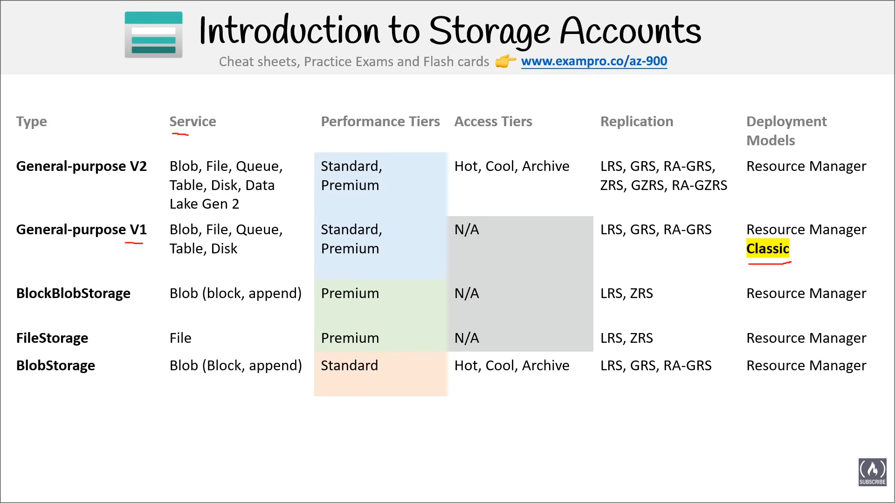

- [Azure Storage Services](#azure-storage-services)
  - [Commonly used services](#commonly-used-services)
    - [Azure Blob Storage](#azure-blob-storage)
    - [Azure Disk Storage](#azure-disk-storage)
    - [Azure File Storage](#azure-file-storage)
    - [\* Azure Queue Storage](#-azure-queue-storage)
    - [\* Azure Table Storage](#-azure-table-storage)
    - [Azure Data Box / Azure Databox Heavy](#azure-data-box--azure-databox-heavy)
    - [Azure Archive Storage](#azure-archive-storage)
    - [Azure Data Lake Storage](#azure-data-lake-storage)
  - [Storage Comparison](#storage-comparison)
    - [Storage Accounts](#storage-accounts)
  - [Core Storage Services](#core-storage-services)
  - [Performance Tiers](#performance-tiers)
    - [Premium](#premium)
    - [Standard](#standard)
  - [Access Tiers](#access-tiers)
    - [Hot](#hot)

# Azure Storage Services

## Commonly used services

### Azure Blob Storage

- *Object Serverless Storage*

- Store very large files and large amounts of unstructured files

- Pay for what you store, unlimited storage, no-resizing volumes, filesystem protocols

### Azure Disk Storage

- A virtual volume.

- SSD or HDD, encryption by default, attach volume to VMs

### Azure File Storage

- A shared volume that you can *access and manage like a file server*

- Used where a shared resource might be needed or if those protocols are useful for services or applications

> [!NOTE]
> The services with an * before them are **not** storage services, but have storage in the name prompting me to put them in this list

### * Azure Queue Storage

- *Messaging queue*

- A data store for queuing and reliably delivering messages between applications

### * Azure Table Storage 

- *Wide-Column NoSQL Database* 

- NoSQL store that hosts unstructured data independent of any schema

### Azure Data Box / Azure Databox Heavy

- To move terabytes or petabytes of data, networking might be too slow

- In such a case, Microsoft sends a dude with a *briefcase computer and storage* designed with all the data

### Azure Archive Storage

- *Long term cold storage* for when you need to hold onto files for years on the cheapest storage option

### Azure Data Lake Storage

- A centralized repository that allows you to store all your structured and unstructured data at any scale

## Storage Comparison

### Storage Accounts

 

## Core Storage Services

- **Azure Blob**: Also includes support for big data analytics through Data Lake Storage Gen2

- **Azure Files**: Managed file shares

- **Azure Queues**

- **Azure Tables**

- **Azure Disks**: Block-level storage volumes for Azure VMs

## Performance Tiers

### Premium

- Higher IOPS (Input / Output Operations Per Second)  

- Stored on SSDs

- Optimized for low latency

- Higher throughput

> [!NOTE]
> In an SSD
> No moving parts and data is distributed randomly

- Use cases:
  - Interactive workloads
  - Analytics
  - AI or ML
  - Data Transformation

### Standard 

- Stored on HDDs

- Varied performance based on access tier (Hot, Cold, Archive)

- Use cases:
    - Backup and disaster recovery
    - Media content
    - Bulk data processing

> [!NOTE]
> In an HDD
> Very good at writing or reading large amounts of data that is close together

## Access Tiers

### Hot  

- Data that's accessed frequently
  
- Highest storage cost, lowest access cost